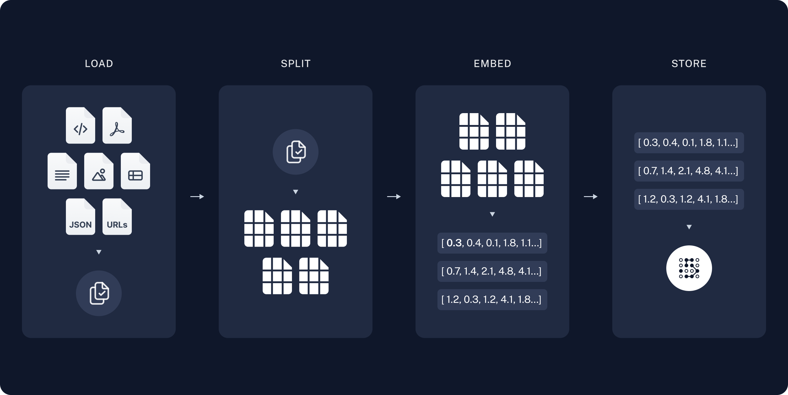

# Description
This project is a RAG application running with local quantized LLM called "smollm" with 135M parameters. I have use [Ollama](https://github.com/ollama/ollama) which is a platform for running and managing large language models (LLMs) on local machine. The application runs entirely on Laptop and can interact via command line.
This chatbot answers any questions based on this [AWS Wikipedia page](https://en.wikipedia.org/wiki/Amazon_Web_Services). You can replace it with any webpage link based on which you want answers from the chatbot. 

<video controls src="RAG_App_demo.mp4" title="Title"></video>

### RAG Architecture Implementation:
**Storage**:

The system ingests data from the source and stores it in a vector database. In this implementation, ChromaDB is used as the vector database.

1. Load: The first step is loading the data using document loaders. In this case, the AWS Wikipedia page was used as the data source.

2. Split: Text splitters are used to break large documents into smaller chunks.

3. Store: The split data needs to be stored and indexed for later search. This is done using a vector store combined with an embeddings model.


**Retrieval and Generation:**

4. The system retrieves relevant context from the vector database and passes it to the LLM (Large Language Model).

5. Retrieve: Given user input, relevant chunks of the document are retrieved from the vector store using a retriever.

6. Generate: The LLM produces a response using a prompt that includes both the user's question and the retrieved data.

# Set up the Environment

```
### Run vectorDB 'chromadb' on localhost:9000
docker run -d -p 9000:8000 --name chromadb chromadb/chroma

### Run ollama server on localhost:11434
docker run -d -v ollama:/root/.ollama -p 11434:11434 --name ollama ollama/ollama

## download model and embedding from the ollama server
docker exec -it ollama ollama pull nomic-embed-text
docker exec -it ollama ollama pull smollm:135m
```

# Download libararies and Run CLI ChatBot
```
pip install -r requirements.txt

python chat.py
```


